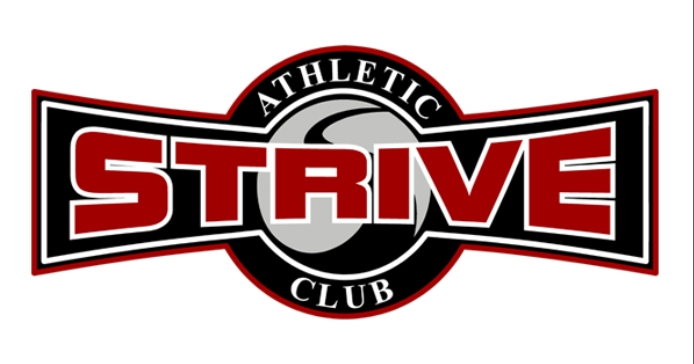

#  **Strive: Strength in Simplicity**

### _Built for those who chase discipline over comfort._

**Motto:** _No excuses. Just effort._

**Logo:**  

##  **About the App**

**Strive** is a modern web application designed to help users **track their fitness journey**, **record workouts**, and **monitor progress** through achievements and levels.

### **Why I Built It**
I built this app beacuse of personal reasoning. I recently just started my fitness journey again and was searching for apps to keep track of my progession made.   Upon searching, I relized that most apps are boring or out-dated and really don't motivate a users progression with achievments or awards.
In a world filled with overcomplicated fitness trackers, **Strive** offers a clean and motivating experience. It gives users the tools to stay consistent — without the noise. 

**Strive** helps users:
- Log workouts easily  
- Track XP and level progression  
- View achievements as milestones  
- Stay accountable through simplicity and style  

---

##  **Getting Started**

###  **Live App**

###  **Planning Materials**
https://trello.com/b/MpZWtloW/fitness-quest
---

##  **Technologies Used**

| Layer | Tools & Frameworks |
|-------|--------------------|
| **Frontend** | HTML5, CSS3 (Custom Theme), Django Templates |
| **Backend** | Python, Django |
| **Database** | SQLite (default), scalable to PostgreSQL |
| **Styling & Design** | Custom CSS, Red/Black Gym Theme, Google Fonts (`Bebas Neue`, `Poppins`) |
| **Version Control** | Git & GitHub |
| **Deployment** |  Heroku |

---

##  **Features**

- Secure user authentication (sign up, log in, log out)  
- Personalized dashboard with XP progress and level tracking  
- Editable user bio section  
- Create, update, and delete workouts  
- Achievement tracking system  
- Clean, responsive UI  
- Consistent professional gym aesthetic (red, black, and grayscale palette)  

---

##  **Next Steps / Future Enhancements**

-  AI-based personalized workout recommendations  
-  Advanced analytics and performance graphs  
-  Mobile app (React Native) for on-the-go tracking  
-  Community feed for progress sharing  
-  Goal reminders and milestone notifications  
-  Achievement badges and streak tracking  
-  auto reccomended workouts accommodated to you level 

